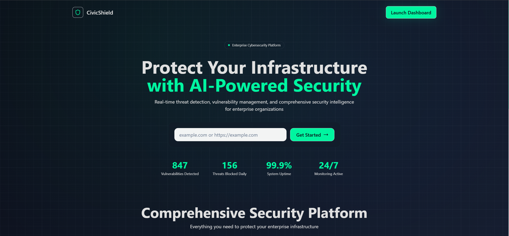
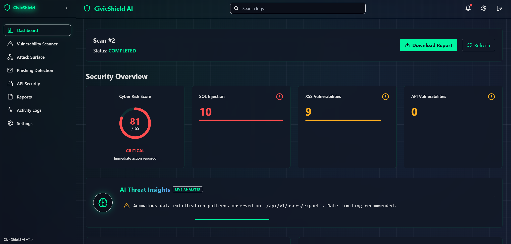
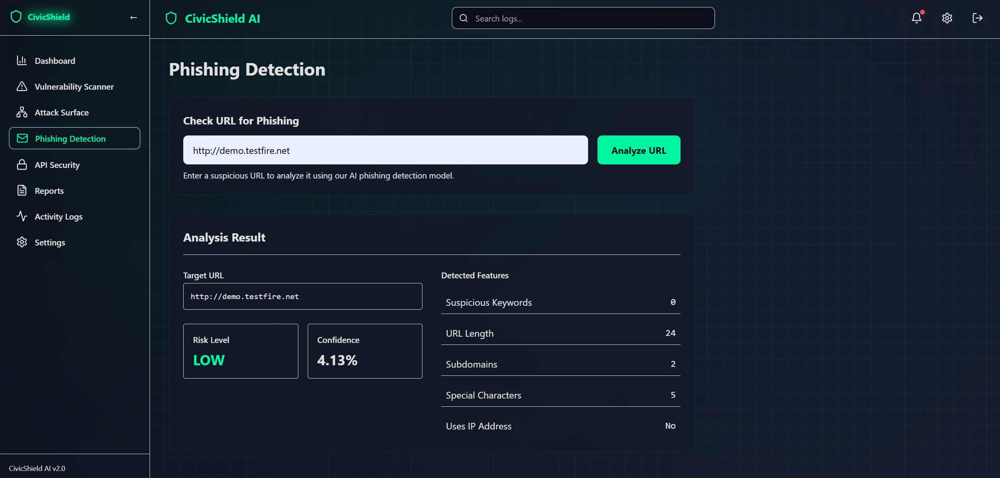
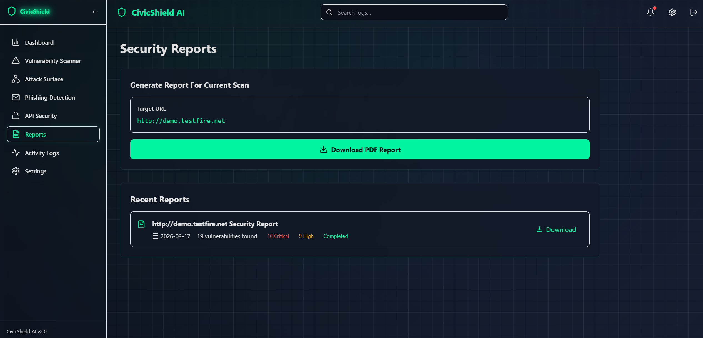

<div align="center">

<!-- HERO BANNER -->


<br/>

<!-- BADGES -->


<br/><br/>

> ### AI-assisted vulnerability scanning | URL phishing classification | executive-ready reporting | global cyber visualization
> *Built for hackathon with a real scan pipeline, phishing model, and demo-safe visualization layer.*
>

<br/>

[🚀 **Live Demo**](https://v0-civic-shield-ai-frontend.vercel.app/) &nbsp;·&nbsp; [📖 **Quick Start**](#-quick-start) &nbsp;·&nbsp; [🧩 **Features**](#-feature-modules) &nbsp;·&nbsp; [🛠️ **Tech Stack**](#️-tech-stack) &nbsp;·&nbsp; [📸 **Screenshots**](#-screenshots)

</div>

---

## 🧠 What is CivicShield AI?

**CivicShield AI** is an AI-powered cybersecurity intelligence platform that gives teams a single command center to **scan**, **monitor**, and **respond** to threats.

This repo is a **Next.js 14 (App Router) frontend** with a modern cyber design system (glassmorphism, grid background, live animations) and **API proxy routes** that connect to a **Python FastAPI backend** for scanning, phishing checks, and PDF report generation.

In short: **what’s vulnerable, what’s happening, and what to fix first** — in one place.

---

## 🏆 Hackathon Highlights

- **One-click “scan → dashboard” flow**: paste a URL on the landing page, start a scan, and get routed straight into a live dashboard.
- **Real-time experience**: scan status updates via SWR polling (near real-time UX without websockets).
- **Executive + technical views**: risk score KPIs for leadership, evidence/payload details for engineers.
- **High-signal visualizations**: threat globe + charts + network graph for fast situational awareness.
- **Production-minded frontend**: clean component structure, theme system, and responsive layout.

---

## 🎬 Demo Flow (2 minutes)

1. **Landing** → enter a target URL and click **Get Started**
2. **Dashboard** → watch **risk score**, metrics, and charts update as results arrive
3. **Threat Globe** → hover points to see simulated live activity + attack paths
4. **Reports** → download a PDF report (via backend)
5. **Surface / Phishing / API Security** → explore additional modules

---

## 📸 Screenshots

Add images to `screenshots/` and update these paths:

- **Landing + Scan Starter**

> The entry point. Paste a target URL, kick off a scan, and jump into the dashboard with a live `scanId`.



- **Dashboard + Threat Globe**

> Your command center. Risk score, threat feed, and a interactive globe showing a simulated threat landscape alongside real scan metrics.



- **Phishing**

> Phishing detection module. Analyze suspicious content and review confidence/risk signals for rapid triage.



- **Reports**

> Audit-ready reporting. Generate and download PDF reports through the backend pipeline.



---

## 🧩 Feature Modules

<details>
<summary><b>🌐 Dashboard — Cyber Risk Command Center</b></summary>
<br/>

- **Cyber Risk Score** — animated 0–100 gauge with severity-weighted scoring.
- **AI Threat Insights** — Framer Motion-powered intelligence feed panel.
- **Live Global Threat Globe** — interactive 3D globe with live points + animated attack arcs (`react-globe.gl`).
- **Security Metrics** — hover-lift stat cards for key categories (SQLi / XSS / API).
- **Trends & Distribution** — Recharts charts for trends + severity breakdown.
- **Vulnerability Table** — expandable evidence/payload details.

</details>

<details>
<summary><b>🔍 Vulnerability Scanner</b></summary>
<br/>

- Target URL validation with immediate feedback
- Real-time scan progress tracking (SWR polling)
- Findings table with severity, evidence, and remediation context

</details>

<details>
<summary><b>📡 Attack Surface Analysis — Network Graph</b></summary>
<br/>

- Interactive network visualization via `react-force-graph-2d`
- Asset inventory + risk indicators

</details>

<details>
<summary><b>🎣 Phishing Detection</b></summary>
<br/>

- Threat score visualization
- Confidence indicators + action tracking

</details>

<details>
<summary><b>🔐 API Security Monitor</b></summary>
<br/>

- Endpoint status + monitoring UI
- JWT verification indicators (UI layer)

</details>

<details>
<summary><b>📄 Reports</b></summary>
<br/>

- PDF report download via Next.js API proxy route

</details>

---

## 🛠️ Tech Stack

| Layer | Technology | Purpose |
|---|---|---|
| **Framework** | Next.js 14 + React 18 | App Router + API routes |
| **Language** | TypeScript | Type-safe UI |
| **Styling** | Tailwind CSS | Cyber theme + glassmorphism |
| **Animations** | Framer Motion | Transitions, feed animations |
| **Charts** | Recharts | Line/bar charts |
| **Network Graph** | React Force Graph 2D | Attack surface visualization |
| **Threat Globe** | `react-globe.gl` + `three` | 3D globe threat visualization |
| **Data Fetching** | SWR | Polling + caching |
| **Notifications** | React Hot Toast | Toast UX |
| **Icons** | Lucide React | Icons |
| **Backend** | Python FastAPI | Scanning + phishing + reports |

---

## ⚡ Quick Start

### Prerequisites

- Node.js 18+
- Python 3.8+ (for the FastAPI backend)

### 1. Install dependencies

```bash
npm install
```

### 2. Configure environment variables

Create `.env.local`:

```env
BACKEND_URL=http://localhost:8000
```
### 3. Run the backend

```bash
python main.py
```

### 3. Run the frontend

```bash
npm run dev
```

Open `http://localhost:3000`.

### 4. Backend (expected endpoints)

This frontend expects a FastAPI backend at `BACKEND_URL` with:

- `POST /scan`
- `GET /scan/{scan_id}`
- `GET /report/{scan_id}`
- `POST /phishing/check`
- `GET /healthz`

---

## 🧪 Local Dev Tips

- **Port in use**: stop old dev servers, then re-run `npm run dev`.
- **Backend required**: dashboard data comes from the FastAPI service at `BACKEND_URL`.
- **No backend?**: UI still loads, but scan actions will fail until `BACKEND_URL` is reachable.

---

## 🗂️ Project Structure

```text
app/
├── api/                    # Next.js API routes (proxy to FastAPI)
│   ├── scan/
│   ├── phishing/
│   └── report/
├── dashboard/
├── scanner/
├── surface/
├── phishing/
├── api-security/
├── reports/
├── logs/
├── settings/
├── globals.css
└── layout.tsx

components/
├── AIThreatInsights.tsx
├── DashboardHeader.tsx
├── MetricCard.tsx
├── RiskGaugeCard.tsx
├── SidebarNav.tsx
├── SkeletonLoader.tsx
├── VulnerabilityTable.tsx
└── WorldMap.tsx
```

---

## 🔌 API Routes (Frontend)

| Route | Purpose |
|---|---|
| `POST /api/scan` | Start a scan |
| `GET /api/scan/[scanId]` | Poll scan status + results |
| `GET /api/report/[scanId]` | Download PDF report |
| `POST /api/phishing` | Phishing check |

---

## 🔒 Security & Privacy Notes

- This is a hackathon prototype: treat scanning targets responsibly and only test assets you own or have permission to assess.
- Avoid committing secrets. Use `.env.local` for environment variables.

---

## 📄 License

This project is licensed under **GNU GPL v3.0**. See `LICENSE`.


## Keep Render Warm

If your backend is deployed on Render and you want to reduce cold starts, this repo now includes a simple keep-warm monitor:

- Backend health endpoint: `GET /healthz`
- GitHub Action scheduler: `.github/workflows/keep-render-warm.yml`
- Manual ping script: `scripts/keep_warm.py`

### GitHub setup

1. Open your GitHub repository settings.
2. Add a repository secret named `RENDER_BACKEND_URL`.
3. Set it to your deployed backend URL, for example:

```env
RENDER_BACKEND_URL=https://your-backend.onrender.com
```

The workflow will ping `https://your-backend.onrender.com/healthz` every 10 minutes and can also be run manually from the Actions tab.

### Manual test

```bash
python scripts/keep_warm.py --base-url https://your-backend.onrender.com
```

If you are on a Render plan that still sleeps aggressively, this reduces cold starts but does not override Render platform limits.


